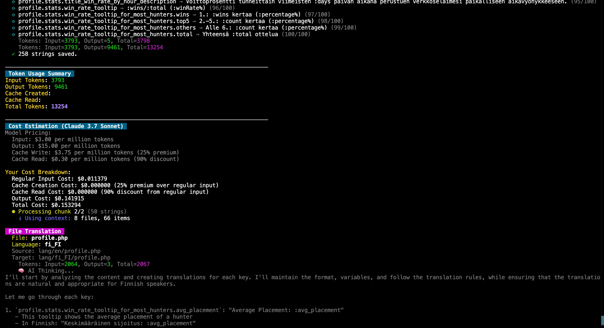

<h1 align="center">Laravel AI Translator by kargnas</h1>

<p align="center">
AI-powered translation tool for Laravel language files
</p>

<p align="center">
<a href="https://github.com/kargnas/laravel-ai-translator/actions"></a>
<a href="https://packagist.org/packages/kargnas/laravel-ai-translator"></a>
<a href="https://packagist.org/packages/kargnas/laravel-ai-translator"></a>
<a href="https://packagist.org/packages/kargnas/laravel-ai-translator"></a>
</p>

<p align="center">
<a href="https://kargn.as/projects/laravel-ai-translator">Official Website</a>
</p>

## 🔄 Recent Updates (March, 2025)

- **AI Enhancement**: Added support for Claude 3.7's Extended Thinking capabilities
  - Extended context window up to 200K tokens, output tokens up to 64K tokens
  - Enhanced reasoning for complex translations
  - Improved context understanding with extended thinking mode
- **Visual Logging Improvements**: Completely redesigned logging system
  - 🎨 Beautiful color-coded console output
  - 📊 Real-time progress indicators
  - 🔍 Detailed token usage tracking with visual stats
  - 💫 Animated status indicators for long-running processes
- **Performance Improvements**: Enhanced translation processing efficiency and reduced API calls
- **Better Error Handling**: Improved error handling and recovery mechanisms
- **Code Refactoring**: Major code restructuring for better maintainability
  - Separated services into dedicated classes
  - Improved token usage tracking and reporting
  - Enhanced console output formatting
- **Testing Improvements**: Added comprehensive test suite using Pest
  - XML parsing validation tests
  - Line break handling in CDATA
  - XML comment tag support
  - Multiple translation items processing
- **XML Processing**: Enhanced XML and AI response parsing system for more reliable translations

## Overview



Laravel AI Translator is a powerful tool designed to streamline the localization process in Laravel projects. It automates the tedious task of translating strings across multiple languages, leveraging advanced AI models to provide high-quality, context-aware translations.

Key benefits:

- Time-saving: Translate all your language files with one simple command
- AI-powered: Utilizes state-of-the-art language models (GPT-4, GPT-4o, GPT-3.5, Claude) for superior translation quality
- Smart context understanding: Accurately captures nuances, technical terms, and Laravel-specific expressions
- Seamless integration: Works within your existing Laravel project structure, preserving complex language file structures

Whether you're working on a personal project or a large-scale application, Laravel AI Translator simplifies the internationalization process, allowing you to focus on building great features instead of wrestling with translations.

## Key Features

- Automatically detects all language folders in your `lang` directory
- Translates PHP language files from a source language (default: English) to all other languages
- Supports multiple AI providers for intelligent, context-aware translations
- Preserves variables, HTML tags, pluralization codes, and nested structures
- Maintains consistent tone and style across translations
- Supports custom translation rules for enhanced quality and project-specific requirements
- Efficiently processes large language files, saving time and effort
- Respects Laravel's localization system, ensuring compatibility with your existing setup
- Chunking functionality for cost-effective translations: Processes multiple strings in a single AI request, significantly reducing API costs and improving efficiency
- String validation to ensure translation accuracy: Automatically checks and validates AI translations to catch and correct any errors or mistranslations

Also, this tool is designed to translate your language files intelligently:

- Contextual Understanding: Analyzes keys to determine if they represent buttons, descriptions, or other UI elements.
- Linguistic Precision: Preserves word forms, tenses, and punctuation in translations.
- Variable Handling: Respects and maintains your language file variables during translation.
- Smart Length Adaptation: Adjusts translation length to fit UI constraints where possible.
- Tone Consistency: Maintains a consistent tone across translations, customizable via configuration.

Do you want to know how this works? See the prompt in `src/AI`.

## Custom Language Styles

In addition to standard language translations, this package now supports custom language styles, allowing for unique and creative localizations.

### Built-in Styles

The package includes several built-in language styles:

- `ko_kp`: North Korean style Korean
- Various regional dialects and language variants

These are automatically available and don't require additional configuration.

### Custom Style Example: Reddit English

As an demonstration of custom styling capabilities, we've implemented a "Reddit style" English:

This style mimics the casual, often humorous language found on Reddit, featuring:

- Liberal use of sarcasm
- Internet slang and meme references
- Playful skepticism

Example configuration:

```php
'locale_names' => [
    'en_reddit' => 'English (Reddit)',
],
'additional_rules' => [
    'en_reddit' => [
        "- Incorporate sarcasm and exaggeration",
        "- Use popular internet slang and meme references",
        "- Add humorous calls for sources on obvious statements",
    ],
],
```

### Creating Custom Styles

You can create your own custom language styles by adding new entries to the `locale_names` and `additional_rules` in the configuration. This allows you to tailor translations to specific audiences or platforms.

These custom styles offer creative ways to customize your translations, adding a unique flair to your localized content. Use responsibly to enhance user engagement while maintaining clarity and appropriateness for your audience.

## Prerequisites

- PHP 8.0 or higher
- Laravel 8.0 or higher

## Installation

1. Install the package via composer:

   ```bash
   composer require kargnas/laravel-ai-translator
   ```

2. Add the OpenAI API key to your `.env` file:

   ```
   OPENAI_API_KEY=your-openai-api-key-here
   ```

   You can obtain an API key from the [OpenAI website](https://platform.openai.com/account/api-keys).

   (If you want to use Anthropic's Claude instead, see step 4 below for configuration instructions.)

3. (Optional) Publish the configuration file:

   ```bash
   php artisan vendor:publish --provider="Kargnas\LaravelAiTranslator\ServiceProvider"
   ```

   This step is optional but recommended if you want to customize the package's behavior. It will create a `config/ai-translator.php` file where you can modify various settings.

4. (Optional) If you want to use Anthropic's Claude instead of OpenAI's GPT, update the `config/ai-translator.php` file:

   ```php
   'ai' => [
       'provider' => 'anthropic',
       'model' => 'claude-3-7-sonnet-20250219',
       'api_key' => env('ANTHROPIC_API_KEY'),
   ],
   ```

   Then, add the Anthropic API key to your `.env` file:

   ```
   ANTHROPIC_API_KEY=your-anthropic-api-key-here
   ```

   You can obtain an Anthropic API key from the [Anthropic website](https://www.anthropic.com).
   For best results, we recommend using the Claude-3-5-Sonnet model for your translations rather than OpenAI GPT. This model provides more accurate and natural translations.

5. You're now ready to use the Laravel AI Translator!

## Usage

To translate your language files, run the following command:

```bash
php artisan ai-translator:translate
```

This command will:

1. Recognize all language folders in your `lang` directory
2. Use AI to translate the contents of the string files in the source language, English. (You can change the source language in the config file)

### Example

Given an English language file:

```php
<?php

return [
    'notifications' => [
        'new_feature_search_sentence' => 'New feature: Now you can type sentences not only words. Even in your languages. The AI will translate them to Chinese.',
        'refresh_after_1_min' => 'Refresh after 1 minutes. New content will be available! (The previous model: :model, Updated: :updated_at)',
    ]
];
```

The package will generate translations like these:

- Korean (ko-kr):
  ```php
  <?php
  return array (
    'notifications.new_feature_search_sentence' => '새로운 기능: 이제 단어뿐만 아니라 문장도 입력할 수 있어요. 심지어 여러분의 언어로도 가능해요.',
    'notifications.refresh_after_1_min' => '1분 후에 새로고침하세요. 새로운 내용이 준비될 거예요! (이전 모델: :model, 업데이트: :updated_at)',
  );
  ```
- Chinese (zh-cn):
  ```php
  <?php
  return array (
    'notifications.new_feature_search_sentence' => '新功能：现在你不仅可以输入单词，还可以输入句子。甚至可以用你的语言。',
    'notifications.refresh_after_1_min' => '1分钟后刷新。新内容即将到来！（之前的模型：:model，更新时间：:updated_at）',
  );
  ```
- Thai (th-th):
  ```php
  <?php
  return array (
    'notifications.new_feature_search_sentence' => 'ฟีเจอร์ใหม่: ตอนนี้คุณพิมพ์ประโยคได้แล้ว ไม่ใช่แค่คำเดียว แม้แต่ภาษาของคุณเอง',
    'notifications.refresh_after_1_min' => 'รีเฟรชหลังจาก 1 นาที จะมีเนื้อหาใหม่ให้ดู! (โมเดลก่อนหน้า: :model, อัปเดตเมื่อ: :updated_at)',
  );
  ```
- 🤣 Korean (North Korea):
  ```php
  <?php
  return array (
    'notifications.new_feature_search_sentence' => '혁명적 새로운 기능: 동무들! 이제 단어뿐만 아니라 문장도 입력하여 단어의 력사를 확인할 수 있습니다. 모국어로도 괜찮습니다. 인공지능이 중국어로 번역해드리겠습니다.',
    'notifications.refresh_after_1_min' => '1분후에 새로고침하십시요. 새로운 내용을 볼수 있습니다! (이전 모델: :model, 갱신: :updated_at)',
  );
  ```
- 🤣 English (Reddit):
  ```php
  <?php
  return array (
    'notifications.new_feature_search_sentence' => 'Whoa, hold onto your keyboards, nerds! We\'ve leveled up our search game. Now you can type entire sentences, not just measly words. Mind. Blown. And get this - it even works in your weird non-English languages! Our AI overlord will graciously translate your gibberish into Chinese. You\'re welcome.',
    'notifications.refresh_after_1_min' => 'Yo, hit that F5 in 60 seconds, fam. Fresh content incoming! (Previous model was :model, last updated when dinosaurs roamed the Earth at :updated_at)',
  );
  ```

## Configuration

If you want to customize the settings, you can publish the configuration file:

```bash
php artisan vendor:publish --provider="Kargnas\LaravelAiTranslator\ServiceProvider"
```

This will create a `config/ai-translator.php` file where you can modify the following settings:

- `source_directory`: If you use a different directory for language files instead of the default `lang` directory, you can specify it here.

- `ai`: Configure the AI provider and model:

  ```php
  'ai' => [
      'provider' => 'anthropic',
      'model' => 'claude-3-5-sonnet-latest',
      'api_key' => env('ANTHROPIC_API_KEY'),
  ],
  ```

  This package supports Anthropic's Claude and OpenAI's GPT models for translations. Here are the tested and verified models:

  | Provider    | Model                      | Extended Thinking | Context Window | Max Tokens |
  | ----------- | -------------------------- | ----------------- | -------------- | ---------- |
  | `anthropic` | `claude-3-7-sonnet-latest` | ✅                | 200K           | 8K/64K\*   |
  | `anthropic` | `claude-3-5-sonnet-latest` | ❌                | 200K           | 8K         |
  | `anthropic` | `claude-3-haiku-20240307`  | ❌                | 200K           | 8K         |
  | `openai`    | `gpt-4o`                   | ❌                | 128K           | 4K         |
  | `openai`    | `gpt-4o-mini`              | ❌                | 128K           | 4K         |

  \* 8K tokens for normal mode, 64K tokens when extended thinking is enabled

  For available models:

  - Anthropic: See [Anthropic Models Documentation](https://docs.anthropic.com/en/docs/about-claude/models)
  - OpenAI: See [OpenAI Models Documentation](https://platform.openai.com/docs/models)

  > **⭐️ Strong Recommendation**: We highly recommend using Anthropic's Claude models, particularly `claude-3-5-sonnet-latest`. Here's why:
  >
  > - More accurate and natural translations
  > - Better understanding of context and nuances
  > - More consistent output quality
  > - More cost-effective for the quality provided
  >
  > While OpenAI integration is available, we strongly advise against using it for translations. Our extensive testing has shown that Claude models consistently produce superior results for localization tasks.

  ### Provider Setup

  1. Get your API key:

     - Anthropic: [Console API Keys](https://console.anthropic.com/settings/keys)
     - OpenAI: [API Keys](https://platform.openai.com/api-keys)

  2. Add to your `.env` file:

     ```env
     # For Anthropic
     ANTHROPIC_API_KEY=your-api-key

     # For OpenAI
     OPENAI_API_KEY=your-api-key
     ```

  3. Configure in `config/ai-translator.php`:
     ```php
     'ai' => [
         'provider' => 'anthropic', // or 'openai'
         'model' => 'claude-3-5-sonnet-latest', // see model list above
         'api_key' => env('ANTHROPIC_API_KEY'), // or env('OPENAI_API_KEY')
     ],
     ```

- `locale_names`: This mapping of locale codes to language names enhances translation quality by providing context to the AI.

- `additional_rules`: Add custom rules to the translation prompt. This is useful for customizing the style of the messages or creating entirely new language styles.

- `disable_plural`: Disable pluralization. Use ":count apples" instead of ":count apple|:count apples"

Example configuration:

```php
<?php

return [
    'source_directory' => 'lang',

    'ai' => [
        'provider' => 'anthropic',
        'model' => 'claude-3-5-sonnet-latest',
        'api_key' => env('ANTHROPIC_API_KEY'),
    ],

    'locale_names' => [
        'en' => 'English',
        'ko' => 'Korean',
        'zh_cn' => 'Chinese (Simplified)',
        // ... other locales
    ],

    'disable_plural' => false,

    'additional_rules' => [
        'default' => [
            "Use a friendly and intuitive tone of voice, like the service tone of voice of 'Discord'.",
        ],
        'ko' => [
            "한국의 인터넷 서비스 '토스'의 서비스 말투 처럼, 유저에게 친근하고 직관적인 말투로 설명하고 존댓말로 설명하세요.",
        ],
    ],
];
```

Make sure to set your chosen AI provider's API key in your `.env` file.

## Supported File Types

Currently, this package only supports PHP language files used by Laravel. JSON language files are not supported, and there are no plans to add support for them in the future.

### Why PHP files only?

We recommend using PHP files for managing translations, especially when dealing with multiple languages. Here's why:

1. **Structure**: PHP files allow for a more organized structure with nested arrays, making it easier to group related translations.

2. **Comments**: You can add comments in PHP files to provide context or instructions for translators.

3. **Performance**: PHP files are slightly faster to load compared to JSON files, as they don't require parsing.

4. **Flexibility**: PHP files allow for more complex operations, such as using variables or conditions in your translations.

5. **Scalability**: When managing a large number of translations across multiple languages, the directory structure of PHP files makes it easier to navigate and maintain.

If you're currently using JSON files for your translations, we recommend migrating to PHP files for better compatibility with this package and improved manageability of your translations.

## TODO List

We're constantly working to improve Laravel AI Translator. Here are some features and improvements we're planning:

- [ ] Implement strict validation for translations:
  - Verify that variables are correctly preserved in translated strings
  - Check for consistency in pluralization rules across translations
- [ ] Expand support for other LLMs (such as Gemini)
- [ ] Replace regex-based XML parser with proper XML parsing:
  - Better handle edge cases and malformed XML

If you'd like to contribute to any of these tasks, please feel free to submit a pull request!

## Contributing

Contributions are welcome! Please feel free to submit a Pull Request.

## License

The MIT License (MIT). Please see [License File](LICENSE.md) for more information.

## Credits

- Created by [Sangrak Choi](https://kargn.as)
- Inspired by [Mandarin Study](https://mandarin.study)

## Read my articles about language

- [Hong Kong vs Taiwan Chinese - Essential UI Localization Guide](https://kargn.as/posts/differences-hong-kong-taiwan-chinese-website-ui-localisation)
- [Setting non-English as the Default Language in a Global Service? Are you crazy?](https://kargn.as/posts/building-global-service-language-settings-considerations)
- [Introducing a Service for Learning Mandarin Chinese Based on Etymology](https://kargn.as/posts/innovative-chinese-mandarin-learning-hanzi-analysis-etymology)
- [Tired of manual translations? I've created an AI translator that actually works.](https://kargn.as/posts/laravel-ai-translator-ai-gpt-composer)
- [Laravel AI Translator v1.1: Smarter, Faster, and More Cost-Effective](https://kargn.as/posts/laravel-ai-translator-v1-1-updates-chunking-validation-laravel11-support)
