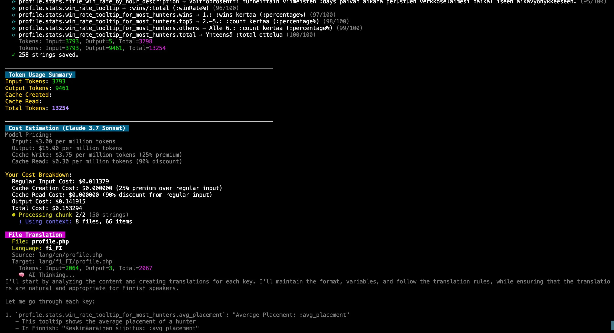

<h1 align="center">Laravel AI Translator by kargnas</h1>

<p align="center">
AI-powered translation tool for Laravel language files
</p>

<p align="center">
<a href="https://github.com/kargnas/laravel-ai-translator/actions"></a>
<a href="https://packagist.org/packages/kargnas/laravel-ai-translator"></a>
<a href="https://packagist.org/packages/kargnas/laravel-ai-translator"></a>
<a href="https://packagist.org/packages/kargnas/laravel-ai-translator"></a>
</p>

<p align="center">
<a href="https://kargn.as/projects/laravel-ai-translator">Official Website</a>
</p>

## Releases

Pushing to `master` starts the release workflow. It waits ten minutes before releasing, and a newer push cancels the pending run and restarts the timer. Automatic releases increment the patch version.

Maintainers can also run the `Release` workflow manually and choose a patch, minor, or major increment. Manual releases use the same ten-minute quiet period. Before publishing, the workflow runs the package tests and PHPStan, updates the version in `composer.json`, commits it, and creates a matching `MAJOR.MINOR.PATCH` tag and GitHub Release.

## 🔄 Recent Updates

- 🔍 **Find & Remove Unused Translations**: New `ai-translator:find-unused` command to detect and optionally remove unused translation keys
  - Scans your codebase for actual translation usage
  - Supports file type-specific comment detection (PHP, JS, JSX, Vue, Blade)
  - Automatic backup before deletion
  - Removes keys from both source and target languages
  - Progress bars for better UX
- 🧹 **Enhanced Clean Command**: Improved pattern matching and backup handling
  - More precise file pattern matching (no more subdirectory confusion)
  - Better handling of backup directories
  - Strict path matching to prevent unintended deletions
- 🔁 **Parallel Translation**: Translate multiple locales concurrently with the `translate-parallel` command
- **AI Providers**: Uses OpenRouter by default while retaining direct OpenAI, Anthropic, and Gemini support
  - Uses PrismPHP for OpenRouter with Claude Opus 5 as the default model
  - Supports GPT-5.6 Sol and Gemini 3.7 Flash model IDs
  - Supports streaming responses and reasoning callbacks
  - Loads pricing from OpenRouter for every provider and caches the catalog for six hours
- **Visual Logging Improvements**: Completely redesigned logging system
  - 🎨 Beautiful color-coded console output
  - 📊 Real-time progress indicators
  - 🔍 Detailed token usage tracking with visual stats
  - 💫 Animated status indicators for long-running processes
- **Performance Improvements**: Enhanced translation processing efficiency and reduced API calls
- **Better Error Handling**: Improved error handling and recovery mechanisms
- **Code Refactoring**: Major code restructuring for better maintainability
  - Separated services into dedicated classes
  - Improved token usage tracking and reporting
  - Enhanced console output formatting
- **Testing Improvements**: Added comprehensive test suite using Pest
  - XML parsing validation tests
  - Line break handling in CDATA
  - XML comment tag support
  - Multiple translation items processing
- **XML Processing**: Enhanced XML and AI response parsing system for more reliable translations

## Overview



Laravel AI Translator is a powerful tool designed to streamline the localization process in Laravel projects. It automates the tedious task of translating strings across multiple languages, leveraging advanced AI models to provide high-quality, context-aware translations.

Key benefits:

- Time-saving: Translate all your language files with one simple command
- AI-powered: Uses current frontier models such as Claude Opus 5, GPT-5.6 Sol, and Gemini 3.7 Flash
- Smart context understanding: Accurately captures nuances, technical terms, and Laravel-specific expressions
- Seamless integration: Works within your existing Laravel project structure, preserving complex language file structures

Whether you're working on a personal project or a large-scale application, Laravel AI Translator simplifies the internationalization process, allowing you to focus on building great features instead of wrestling with translations.

## Key Features

- Automatically detects all language folders in your `lang` directory
- Translates PHP language files from a source language (default: English) to all other languages
- Supports multiple AI providers for intelligent, context-aware translations
- Preserves variables, HTML tags, pluralization codes, and nested structures
- Maintains consistent tone and style across translations
- Supports custom translation rules for enhanced quality and project-specific requirements
- Efficiently processes large language files, saving time and effort
- Respects Laravel's localization system, ensuring compatibility with your existing setup
- Chunking functionality for cost-effective translations: Processes multiple strings in a single AI request, significantly reducing API costs and improving efficiency
- String validation to ensure translation accuracy: Automatically checks and validates AI translations to catch and correct any errors or mistranslations

Also, this tool is designed to translate your language files intelligently:

- Contextual Understanding: Analyzes keys to determine if they represent buttons, descriptions, or other UI elements.
- Linguistic Precision: Preserves word forms, tenses, and punctuation in translations.
- Variable Handling: Respects and maintains your language file variables during translation.
- Smart Length Adaptation: Adjusts translation length to fit UI constraints where possible.
- Tone Consistency: Maintains a consistent tone across translations, customizable via configuration.

Do you want to know how this works? See the prompt in `src/AI`.

## Custom Language Styles

In addition to standard language translations, this package now supports custom language styles, allowing for unique and creative localizations.

### Built-in Styles

The package includes several built-in language styles:

- `ko_kp`: North Korean style Korean
- Various regional dialects and language variants

These are automatically available and don't require additional configuration.

### Custom Style Example: Reddit English

As an demonstration of custom styling capabilities, we've implemented a "Reddit style" English:

This style mimics the casual, often humorous language found on Reddit, featuring:

- Liberal use of sarcasm
- Internet slang and meme references
- Playful skepticism

Example configuration:

```php
'locale_names' => [
    'en_reddit' => 'English (Reddit)',
],
'additional_rules' => [
    'en_reddit' => [
        "- Incorporate sarcasm and exaggeration",
        "- Use popular internet slang and meme references",
        "- Add humorous calls for sources on obvious statements",
    ],
],
```

### Creating Custom Styles

You can create your own custom language styles by adding new entries to the `locale_names` and `additional_rules` in the configuration. This allows you to tailor translations to specific audiences or platforms.

These custom styles offer creative ways to customize your translations, adding a unique flair to your localized content. Use responsibly to enhance user engagement while maintaining clarity and appropriateness for your audience.

## Prerequisites

- PHP 8.2 or higher
- Laravel 11.0 or higher

## Installation

1. Install the package via composer:

   ```bash
   composer require kargnas/laravel-ai-translator
   ```

2. Add your OpenRouter API key to `.env`:

   ```env
   OPENROUTER_API_KEY=your-openrouter-api-key-here
   ```

   Create a key in [OpenRouter](https://openrouter.ai/settings/keys).

3. (Optional) Publish the configuration file:

   ```bash
   php artisan vendor:publish --provider="Kargnas\LaravelAiTranslator\ServiceProvider"
   ```

   This step is optional but recommended if you want to customize the package's behavior. It will create a `config/ai-translator.php` file where you can modify various settings.

4. (Optional) Change `ai.model` in `config/ai-translator.php`. See the configuration section below and [OpenRouter Models](https://openrouter.ai/models) for current model IDs and limits.

5. You're now ready to use the Laravel AI Translator!

## Usage

To translate your language files, run the following command:

```bash
php artisan ai-translator:translate
```

To speed up translating multiple locales, you can run them in parallel:

```bash
php artisan ai-translator:translate-parallel
```

Specify target locales separated by commas using the `--locale` option. For example:

```bash
php artisan ai-translator:translate-parallel --locale=ko,ja
```

If you omit the `--locale` option, the command automatically translates all available locales.

This command will:

1. Recognize all language folders in your `lang` directory
2. Use AI to translate the contents of the string files in the source language, English. (You can change the source language in the config file)

### Finding and Removing Unused Translations

To find translation keys that are no longer used in your codebase:

```bash
php artisan ai-translator:find-unused [options]
```

This command scans your source code to identify unused translation keys and optionally removes them.

#### Features

- **Smart Code Scanning**: Analyzes PHP, JavaScript, Vue, and Blade files
- **Comment Awareness**: Ignores translation keys in comments (file type specific)
- **Dynamic Key Detection**: Recognizes template literal patterns like `${variable}`
- **Automatic Cleanup**: Optionally removes unused keys from all language files
- **Backup Protection**: Creates automatic backups before deletion
- **Source Language Support**: Removes keys from source language as well

#### Options

- `--source=LOCALE`: Source language to analyze (default: from config)
- `--scan-path=PATH`: Directories to scan (default: app, resources/views)
- `--format=FORMAT`: Output format (table, json, summary)
- `--show-files`: Show which files contain unused translations
- `-f|--force`: Automatically delete without confirmation

#### Examples

```bash
# Find unused translations (interactive deletion prompt)
php artisan ai-translator:find-unused

# Scan specific directories
php artisan ai-translator:find-unused --scan-path=app --scan-path=resources

# Auto-delete without confirmation
php artisan ai-translator:find-unused --force

# Show detailed file information
php artisan ai-translator:find-unused --show-files

# Output as JSON
php artisan ai-translator:find-unused --format=json
```

The command automatically:
- Creates timestamped backups in `lang/backup-before-unused/` before deletion
- Detects translation usage patterns in all major file types
- Removes commented-out code to avoid false positives
- Shows progress bars during deletion for better UX

### Cleaning Translations

To remove translated strings and prepare for re-translation, use the clean command:

```bash
php artisan ai-translator:clean [pattern] [options]
```

This command removes translations from locale files while preserving your source language, allowing you to regenerate translations with updated AI models or rules.

#### Arguments

- `pattern`: Optional pattern to match files or keys
  - `enums` - matches `lang/{locale}/enums.php` files only (not subdirectories)
  - `foo/bar` - matches exact path `lang/{locale}/foo/bar.php`
  - `enums.heroes` - matches specific keys within files

#### Options

- `-s|--source=LOCALE`: Source locale to exclude from cleaning (default: from config)
- `-f|--force`: Skip confirmation prompt
- `--no-backup`: Skip creating backup files
- `--dry-run`: Preview changes without deletion

#### Examples

```bash
# Remove all translations from all target locales (interactive confirmation)
php artisan ai-translator:clean

# Remove translations from specific file (direct matches only)
php artisan ai-translator:clean enums

# Remove translations from exact subdirectory path
php artisan ai-translator:clean auth/login

# Remove specific key translations
php artisan ai-translator:clean enums.heroes

# Specify different source locale
php artisan ai-translator:clean --source=es

# Skip confirmation and backup
php artisan ai-translator:clean enums --force --no-backup

# Preview what would be deleted
php artisan ai-translator:clean enums --dry-run
```

The command automatically:
- Creates backups in `lang/backup/` before deletion (unless `--no-backup` is used)
- Uses strict pattern matching (no wildcards in subdirectories)
- Excludes backup directories from being treated as locales
- Shows detailed statistics before performing deletions
- Prevents accidental overwrites by checking for existing backup directories

### Example

Given an English language file:

```php
<?php
return [
    'expertise' => [
        'coding' => [
            'title' => 'Coding & Product',
            'description' => 'Coding is practically my entire life. I started creating fan sites for Harry Potter and StarCraft when I was 11 years old. Before becoming a university student, I developed various game-related web services such as Nexus TK, TalesWeaver, and MapleStory. During my university days, I earned money by doing part-time jobs creating websites. My current company, OP.GG, is also an extension of the game-related services I\'ve been developing since childhood, which gives me a great sense of pride.',
        ],
    ],
];
```

The package will generate translations like these:

- Korean:
  ```php
  <?php
  return [
      'expertise' => [
          'coding' => [
              'title' => '코딩 & 제품',
              'description' => '코딩은 사실상 제 인생 전부입니다. 11살 때부터 해리 포터와 스타크래프트 팬 사이트를 만들기 시작했습니다. 대학생이 되기 전에 넥서스 TK, 테일즈위버, 메이플스토리와 같은 다양한 게임 관련 웹 서비스를 개발했습니다. 대학 시절에는 웹사이트를 만드는 아르바이트로 돈을 벌었습니다. 현재 제 회사인 OP.GG도 어린 시절부터 개발해 온 게임 관련 서비스의 연장선으로, 이는 저에게 큰 자부심을 줍니다.',
          ]
      ]
  ];
  ```
- Simplified Chinese:
  ```php
  <?php
  return [
      'expertise' => [
          'coding' => [
              'title' => '编程与产品',
            'description' => '编程几乎就是我的整个生活。11岁时，我就开始为《哈利·波特》和《星际争霸》创建粉丝网站。在上大学之前，我开发了各种游戏相关网络服务，如Nexus TK、TalesWeaver和冒险岛。大学期间，我通过创建网站的兼职工作赚钱。我现在的公司OP.GG，也  是我从小就在开发的游戏相关服务的延伸，这让我感到非常自豪。'
          ]
      ]
  ];
  ```
- Thai:
  ```php
  <?php
  return [
      'expertise' => [
          'coding' => [
              'title' => 'Coding & Product',
              'description' => 'การเขียนโค้ดเป็นเรื่องที่อยู่ในชีวิตผมแทบทั้งหมด ผมเริ่มสร้างเว็บไซต์แฟนคลับสำหรับแฮร์รี่ พอตเตอร์และสตาร์คราฟท์ตั้งแต่อายุ 11 ปี ก่อนที่จะเข้ามหาวิทยาลัย ผมได้พัฒนาเว็บบริการเกี่ยวกับเกมต่างๆ เช่น Nexus TK, TalesWeaver และ MapleStory ในช่วงมหาวิทยาลัย ผมหาเงินด้วยการทำงานพาร์ทไทม์สร้างเว็บไซต์ บริษัทปัจจุบันของผม OP.GG ก็เป็นส่วนขยายของบริการเกี่ยวกับเกมที่ผมได้พัฒนามาตั้งแต่เด็ก ซึ่งทำให้ผมรู้สึกภูมิใจเป็นอย่างมาก',
          ]
      ]
  ];
  ```
- Japanese:
  ```php
  <?php
  return [
      'expertise' => [
          'coding' => [
              'title' => 'コーディング＆プロダクト',
              'description' => 'コーディングは私の人生そのものです。11歳の時からハリーポッターやスタークラフトのファンサイトを作り始めました。大学生になる前に、Nexus TK、テイルズウィーバー、メイプルストーリーなどのゲーム関連のウェブサービスを開発していました。大学時代には、ウェブサイト制作のアルバイトでお金を稼いでいました。現在の会社OP.GGも、子供の頃から開発してきたゲーム関連サービスの延長線上にあり、それが大きな誇りとなっています。',
          ]
      ]
  ];
  ```
- 🤣 Simplified Chinese (Dongbei Dialect):
  ```php
  <?php
  return [
      'expertise' => [
          'coding' => [
              'title' => '写代码和整产品',
              'description' => '写代码简直就是俺的命根子。俺11岁那会儿就开始整哈利波特和星际争霸的粉丝网站了。上大学前，俺整了不少游戏网站，啥Nexus TK啊，TalesWeaver啊，还有冒险岛啊。上大学那会儿，俺靠给人整网站挣了不少零花钱。现在俺这公司OP.GG，也就是俺从小整的游戏服务的延续，这让俺贼有成就感。'
          ]
      ]
  ];
  ```
- 🤣 Korean (North Korea):
  ```php
  <?php
  return [
      'expertise' => [
          'coding' => [
              'title' => '콤퓨터프로그람작성 & 제품',
              'description' => '프로그람작성은 혁명적으로 나의 전생애입니다. 11살때부터 해리 포터와 스타크래프트 애호가싸이트를 만들기 시작하였습니다. 대학생이 되기전에 넥서스 TK, 테일즈위버, 메이플스토리와 같은 혁명적인 게임관련 망봉사들을 개발하였습니다. 대학시절에는 웹싸이트를 만드는 림시일로 돈을 벌었습니다. 현재 나의 회사인 OP.GG도 어린시절부터 개발하여온 게임관련 봉사의 련장선으로, 이는 나에게 큰 혁명적자부심을 줍니다.',
          ]
      ]
  ];
  ```
- 🤣 Korean (Busan Dialect):
  ```php
  <?php
  return [
      'expertise' => [
          'coding' => [
              'title' => '코딩 & 제품',
              'description' => '코딩은 사실상 제 인생 전부라 카모. 11살 때부터 해리 포터캉 스타크래프트 팬 사이트 만들기 시작했데이. 대학생이 되기 전에는 넥서스 TK, 테일즈위버, 메이플스토리 같은 여러 게임 관련 웹 서비스 개발했디. 대학 다닐 때는 웹사이트 만드는 아르바이트로 돈 벌었데이. 지금 제 회사인 OP.GG도 어릴 때부터 개발해 온 게임 관련 서비스으 연장선인데, 이기 내인데 억수로 자부심이 된다 카모.',
          ]
      ]
  ];
  ```
- 🤣 English (Reddit):
  ```php
  <?php
  return [
      'expertise' => [
          'coding' => [
              'title' => 'Coding & Product',
              'description' => 'Coding is practically my entire life, duh. Started building Harry Potter and StarCraft fan sites at 11 (yeah, I was *that* kid). Before even hitting university, I was already knee-deep in game sites like Nexus TK, TalesWeaver, and MapleStory. Paid my way through college building websites - because who needs a social life, right? Now I run OP.GG, which is basically just the grown-up version of what little-me was doing in his bedroom. Not gonna lie, pretty damn proud of that full-circle moment.',
          ]
      ]
  ];
  ```

## Configuration

If you want to customize the settings, you can publish the configuration file:

```bash
php artisan vendor:publish --provider="Kargnas\LaravelAiTranslator\ServiceProvider"
```

This will create a `config/ai-translator.php` file where you can modify the following settings:

- `source_directory`: If you use a different directory for language files instead of the default `lang` directory, you can specify it here.

- `ai`: Configure the AI provider and model:

  ```php
  'ai' => [
      'provider' => 'openrouter',
      'model' => 'vendor/model-id',
      'api_key' => env('OPENROUTER_API_KEY'),
  ],
  ```

  OpenRouter is the default, not the only supported provider. The package default is defined in [`config/ai-translator.php`](config/ai-translator.php). Current provider examples:

  | Provider               | Model                           | API key variable        |
  | ---------------------- | ------------------------------- | ----------------------- |
  | `openrouter` (default) | `anthropic/claude-opus-5`       | `OPENROUTER_API_KEY`    |
  | `openrouter`           | `openai/gpt-5.6-sol`            | `OPENROUTER_API_KEY`    |
  | `openrouter`           | `google/gemini-3.7-flash`       | `OPENROUTER_API_KEY`    |
  | `openai`               | `gpt-5.6-sol`                   | `OPENAI_API_KEY`        |
  | `anthropic`            | `claude-opus-5`                 | `ANTHROPIC_API_KEY`     |
  | `gemini`               | `gemini-3.7-flash`              | `GEMINI_API_KEY`        |

  Check current availability and limits in the [OpenRouter model catalog](https://openrouter.ai/models).

  Cost reports use the public OpenRouter model catalog for both OpenRouter and direct-provider requests. The catalog is cached for six hours, and direct-provider credentials are never sent to OpenRouter.

  ### Provider Setup

  1. Create an API key for the provider you want to use. For the default provider, create one in [OpenRouter](https://openrouter.ai/settings/keys).

  2. Add to your `.env` file:

     ```env
     OPENROUTER_API_KEY=your-api-key
     ```

  3. Configure the matching provider, model, and API key in `config/ai-translator.php`:
     ```php
     'ai' => [
        'provider' => 'openrouter',
        'model' => 'vendor/model-id',
        'api_key' => env('OPENROUTER_API_KEY'),
     ],
     ```

- `locale_names`: This mapping of locale codes to language names enhances translation quality by providing context to the AI.

- `consensus`: Optional multi-translator mode. Configure two or more entries in `translators` plus a `judge`; each translator handles the full chunk and the judge selects the best candidate per key. Leave `translators` empty to use the single `ai` configuration:

  ```php
  'consensus' => [
      'translators' => [
          ['provider' => 'anthropic', 'model' => 'claude-sonnet-4-20250514', 'api_key' => env('ANTHROPIC_API_KEY')],
          ['provider' => 'openrouter', 'model' => 'anthropic/claude-sonnet-4.5', 'api_key' => env('OPENROUTER_API_KEY')],
      ],
      'judge' => [
          'provider' => 'openrouter',
          'model' => 'anthropic/claude-sonnet-4.5',
          'api_key' => env('OPENROUTER_API_KEY'),
      ],
  ],
  ```

- `additional_rules`: Add custom rules to the translation prompt. This is useful for customizing the style of the messages or creating entirely new language styles.

- `disable_plural`: Disable pluralization. Use ":count apples" instead of ":count apple|:count apples"

Example configuration:

```php
<?php

return [
    'source_directory' => 'lang',

    'ai' => [
        'provider' => 'openrouter',
        'model' => 'vendor/model-id',
        'api_key' => env('OPENROUTER_API_KEY'),
    ],

    'locale_names' => [
        'en' => 'English',
        'ko' => 'Korean',
        'zh_cn' => 'Chinese (Simplified)',
        // ... other locales
    ],

    'disable_plural' => false,

    'additional_rules' => [
        'default' => [
            "Use a friendly and intuitive tone of voice, like the service tone of voice of 'Discord'.",
        ],
        'ko' => [
            "한국의 인터넷 서비스 '토스'의 서비스 말투 처럼, 유저에게 친근하고 직관적인 말투로 설명하고 존댓말로 설명하세요.",
        ],
    ],
];
```

Make sure to set your chosen AI provider's API key in your `.env` file.

## Supported File Types

This package supports both PHP and JSON language files used by Laravel:

### PHP Language Files
```bash
php artisan ai-translator:translate
php artisan ai-translator:translate-parallel
```

These commands translate PHP language files located in subdirectories like `lang/en/`, `lang/ko/`, etc.

### JSON Language Files
```bash
php artisan ai-translator:translate-json
```

This command translates root-level JSON language files like `lang/en.json`, `lang/ko.json`, etc.

All translation commands support the same powerful features:
- **Interactive language selection**: Choose source and target languages interactively
- **Reference language support**: Use high-quality translations as reference for better results
- **Chunking**: Process multiple strings in batches for cost-effective API usage
- **Progress tracking**: Real-time progress indicators with colorful console output
- **Token usage monitoring**: Track and display API token consumption and costs
- **Context awareness**: Maintain translation consistency across files

### Command Options

All translation commands support these options:

- `--source=LOCALE`: Source language (e.g., `--source=en`)
- `--locale=LOCALE1,LOCALE2`: Target locales (e.g., `--locale=ko,ja`)
- `--reference=LOCALE1,LOCALE2`: Reference languages for guidance (e.g., `--reference=fr,es`)
- `--max-tokens-per-chunk=TOKENS`: Maximum estimated source tokens per translation request (default: 1500)
- `--max-context=COUNT`: Maximum context items (default: 1000)
- `--force-big-files`: Force translation of files with 500+ strings
- `--force-retranslate`: Bypass source change detection
- `--show-prompt`: Display AI prompts during translation
- `--non-interactive`: Run without interactive prompts

### File Structure Examples

**PHP Files:**
```
lang/
├── en/
│   ├── auth.php
│   ├── validation.php
│   └── messages.php
├── ko/
│   ├── auth.php
│   ├── validation.php
│   └── messages.php
```

**JSON Files:**
```
lang/
├── en.json
├── ko.json
├── ja.json
└── fr.json
```

### Why Support Both Formats?

**PHP Files Benefits:**
- Nested array structure for better organization
- Support for comments and context
- Slightly better performance
- More flexibility for complex translations

**JSON Files Benefits:**
- Simpler flat structure
- Easier to edit manually
- Better for frontend JavaScript integration
- Widely supported format

Choose the format that best fits your project's needs - this package handles both seamlessly!

## TODO List

We're constantly working to improve Laravel AI Translator. Here are some features and improvements we're planning:

- [ ] Implement strict validation for translations:
  - Verify that variables are correctly preserved in translated strings
  - Check for consistency in pluralization rules across translations
- [ ] Replace regex-based XML parser with proper XML parsing:
  - Better handle edge cases and malformed XML

If you'd like to contribute to any of these tasks, please feel free to submit a pull request!

## Contributing

Contributions are welcome! Please feel free to submit a Pull Request.

## License

The MIT License (MIT). Please see [License File](LICENSE.md) for more information.

## Credits

- Created by [Sangrak Choi](https://kargn.as)
- Inspired by [Mandarin Study](https://mandarin.study)

## Read my articles about language

- [Hong Kong vs Taiwan Chinese - Essential UI Localization Guide](https://kargn.as/posts/differences-hong-kong-taiwan-chinese-website-ui-localisation)
- [Setting non-English as the Default Language in a Global Service? Are you crazy?](https://kargn.as/posts/building-global-service-language-settings-considerations)
- [Introducing a Service for Learning Mandarin Chinese Based on Etymology](https://kargn.as/posts/innovative-chinese-mandarin-learning-hanzi-analysis-etymology)
- [Tired of manual translations? I've created an AI translator that actually works.](https://kargn.as/posts/laravel-ai-translator-ai-gpt-composer)
- [Laravel AI Translator v1.1: Smarter, Faster, and More Cost-Effective](https://kargn.as/posts/laravel-ai-translator-v1-1-updates-chunking-validation-laravel11-support)
